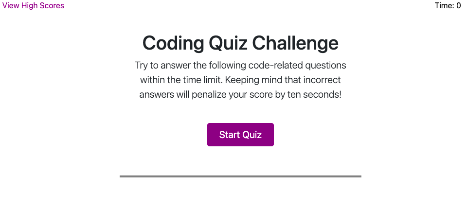
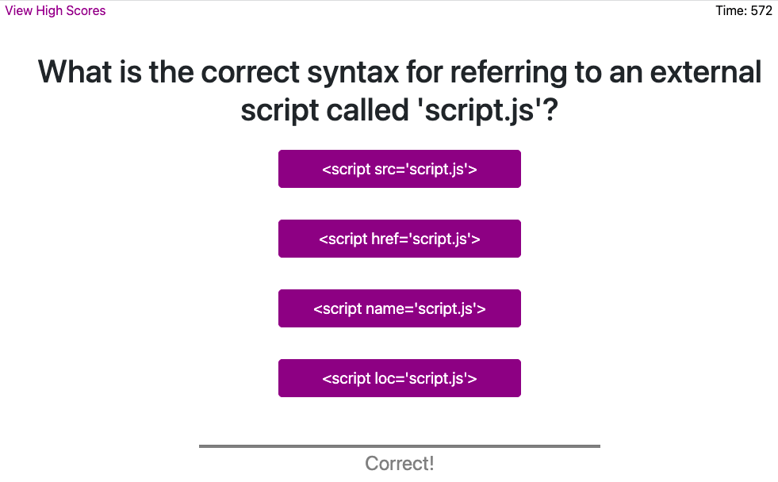

# Code-Quiz

---

Code-Quiz ia a 10 question Javascript quiz to test your skills. You have 10 minutes to complete the quiz and any wrong answers will deduct 10 seconds from your time (score).
​
## User Interface

## Usage
After clicking start the timer will begin. As you select answers you will get immeadiate feedback. Once you complete the quiz you will be asked to enter your initials for the High Score list. You can choose 'Go Back' to retake the quiz, or you can choose 'Clear High Scores' to erase the current High Score list. Good Luck!

## Links to website and Github
[Code-Quiz website](https://bagl0025.github.io/Code-Quiz/)

[Github Repository](https://github.com/bagl0025/Code-Quiz.git)

## Author
Brian Bagley

April 2022
